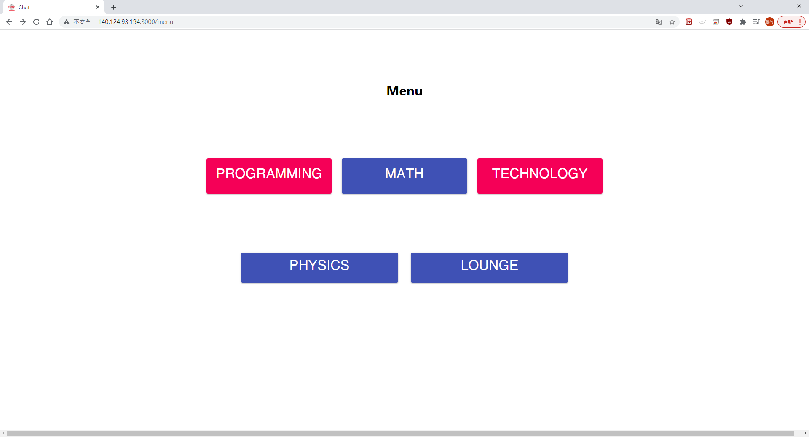
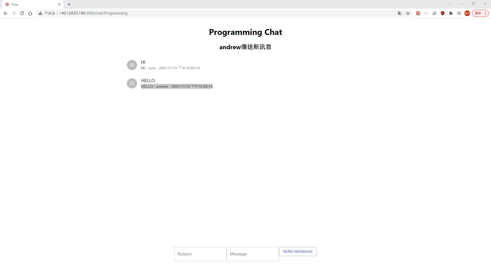

| Supported Clients        | Preview                 |
| ------------------------ | ----------------------- |
| Web(Home)                |   |
| Web(menu)                |   |
| Web(Chatroom)            |   |
| MongoDB                  |   |


* IDE:WebStorm

### Front-end:

* React
* React-hook
* TypeScript

### Backend:

* Node/Express
* MongoDB/Mongoose
* WebSocket

### Folder structure

```
.                                
|
├── client                            
|   ├── public                   
|   ├── src                     
|   |   ├── componemts            
|   |   |   ├── Chat
|   |   |   |   ├── Programming
|   |   |   |   ├── Math  
|   |   |   |   ├── Physics   
|   |   |   |   ├── Technology  
|   |   |   |   ├── Lounge            
|   |   |   ├── Home        
|   |   |   ├── Login
|   |   |   ├── Menu       
|   |   |   └── Register    
├── server
|   ├── build                    
|   |   ├── models     
|   |   |   ├── messages.js        
|   |   |   ├── user.js  
|   |   ├── messagesFunction.js
|   |   ├── server.js 
|   |   ├── utility.js
|   |   ├── websocket.js  
|   ├── models                   
|   |   ├── messages.ts    
|   |   ├── user.ts   
|   ├──messagesFunction.ts
|   ├──server.ts
|   ├──utility.ts
|   ├──websocket.ts            
└── package.json   

last update 21/11/10         